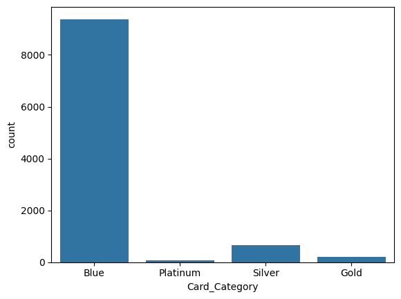
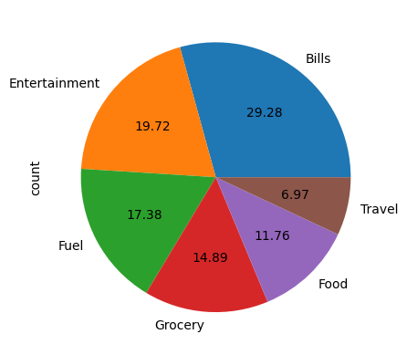

# HSBC Credit Card Intelligence Dashboard

## 📌 Overview

An end-to-end Power BI Business Intelligence project designed to analyze HSBC credit card transactions and customer behavior. The dashboard provides insights into revenue generation, spending patterns, customer demographics, card performance, and week-over-week business growth through interactive visualizations and KPI tracking.

## 🎯 Project Objectives

* Analyze credit card transaction performance.
* Monitor revenue and transaction trends.
* Identify high-value customer segments.
* Evaluate card category performance.
* Understand customer demographics and spending behavior.
* Track week-over-week business growth metrics.
* Enable data-driven decision-making through interactive dashboards.

---

## 🛠️ Tech Stack

* Power BI Desktop
* SQL
* DAX (Data Analysis Expressions)
* Power Query
* Excel

---

## 📊 Dashboard Preview

### Transaction Dashboard



**Key Insights**
- Total Revenue: $57M
- Total Transaction Amount: $45.5M
- Total Interest Earned: $7.98M
- Total Transactions: 667K
- Revenue breakdown by card category, education level, expense type, and payment method.

---

### Expense Type Analysis Dashboard



**Key Insights**
- Bills generate the highest revenue ($14M).
- Entertainment and Fuel are the next highest contributors.
- Businessman and White-collar segments drive significant revenue.
- Quarterly revenue and transaction trends are tracked.

---

### Activation Rate & Weekly Performance Dashboard


**Key Insights**
- Weekly Revenue Growth: 35.04%
- Customer Growth: 12.80%
- Income Growth: 18.23%
- Transaction Count Growth: 3.39%
- Week-over-week business performance monitoring.

---

## 📈 Key Metrics

| Metric                      | Value   |
| --------------------------- | ------- |
| Total Revenue               | $57M    |
| Transaction Amount          | $45.5M  |
| Total Interest Earned       | $7.98M  |
| Total Transactions          | 667K    |
| Total Income                | $587.6M |
| Customer Satisfaction Score | 3.19    |

---

## 🚀 Dashboard Features

### 1. Transaction Analysis

* Revenue by Card Category
* Revenue by Expense Type
* Revenue by Customer Job
* Revenue by Education Level
* Revenue by Payment Method
* Quarterly Revenue Trends
* Interest Earned Analysis

### 2. Customer Analysis

* Revenue by Gender
* Revenue by Age Group
* Revenue by Marital Status
* Revenue by Education Level
* Revenue by Occupation
* Revenue by State
* Customer Revenue Trends

### 3. Weekly Performance Analysis

* Week-over-Week Revenue Growth
* Customer Growth Tracking
* Income Growth Analysis
* Transaction Growth Analysis
* Delinquent Account Analysis
* Card Category Contribution Analysis

---

## 💡 Key Business Insights

### Card Category Performance

| Card Category | Revenue Share |
| ------------- | ------------- |
| Blue          | 83.49%        |
| Silver        | 10.01%        |
| Gold          | 4.48%         |
| Platinum      | 2.01%         |

Blue cards contribute the majority of business revenue, accounting for more than 83% of total revenue generated.

### Revenue by Payment Method

| Payment Method | Revenue |
| -------------- | ------- |
| Swipe          | $36M    |
| Chip           | $17M    |
| Online         | $4M     |

Swipe transactions generate the highest revenue, indicating customer preference for physical card transactions.

### Revenue by Expense Type

| Expense Type  | Revenue |
| ------------- | ------- |
| Bills         | $14M    |
| Entertainment | $9.8M   |
| Fuel          | $9.6M   |
| Grocery       | $8.7M   |
| Food          | $8.4M   |
| Travel        | $6M     |

Bills and entertainment are the largest contributors to overall revenue.

### Revenue by Customer Job

| Customer Segment | Revenue |
| ---------------- | ------- |
| Businessman      | $17.7M  |
| White-collar     | $10.3M  |
| Self-employed    | $8.5M   |
| Government       | $8.3M   |
| Blue-collar      | $7.0M   |
| Retirees         | $4.6M   |

Businessmen represent the most valuable customer segment.

---

## 📅 Weekly Performance Highlights

| Metric                   | Growth |
| ------------------------ | ------ |
| Revenue Growth           | 35.04% |
| Transaction Count Growth | 3.39%  |
| Customer Growth          | 12.80% |
| Income Growth            | 18.23% |

The dashboard tracks week-over-week performance, enabling stakeholders to monitor business growth and customer acquisition trends.

---

## 🗂️ Project Structure

```text
HSBC-Credit-Card-Intelligence-Dashboard
│
├── Credit_Card.xlsx
├── Customer.xlsx
├── Credit_Card_Report.pbix
├── Credit_Card_Report.pdf
├── HSBC Report-Finance.pdf
├── SQL Query.sql
├── Credit_Card.ipynb
├── download.png
├── download 2.png
├── download 3.png
└── README.md
```

## ⚙️ Workflow

1. Extracted transaction and customer data.
2. Cleaned and transformed data using Power Query.
3. Built relationships between tables.
4. Created DAX measures and KPIs.
5. Developed interactive Power BI dashboards.
6. Generated business insights through visual analytics.

---

## 📌 Business Impact

This dashboard enables stakeholders to:

* Monitor financial performance in real time.
* Identify profitable customer segments.
* Understand spending behavior across demographics.
* Track growth trends and revenue drivers.
* Make informed strategic and operational decisions.

---

## 🏆 Resume Project Description

**HSBC Credit Card Intelligence Dashboard | Power BI, SQL, DAX**

* Developed an interactive Power BI dashboard analyzing 667K+ credit card transactions and $57M revenue to monitor business performance and customer behavior.
* Built SQL queries, data models, and DAX measures to track revenue, transaction growth, customer acquisition, and weekly performance metrics.
* Delivered actionable insights on card categories, spending patterns, customer demographics, and revenue drivers through dynamic visualizations.

---

## 👨‍💻 Author

**Samad Qureshi**

* GitHub: https://github.com/mmdsamadqureshi
* LinkedIn: https://www.linkedin.com/in/muhammadsamadqureshi
